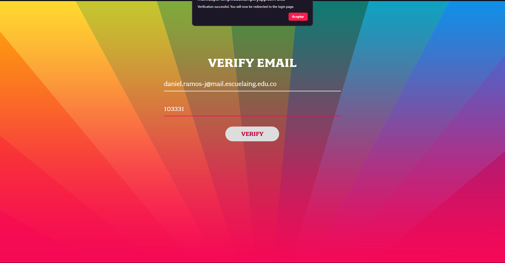
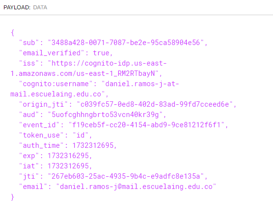
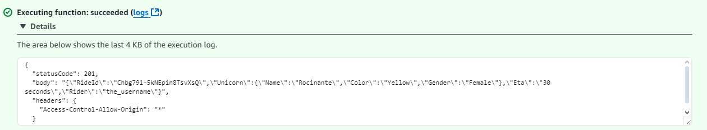
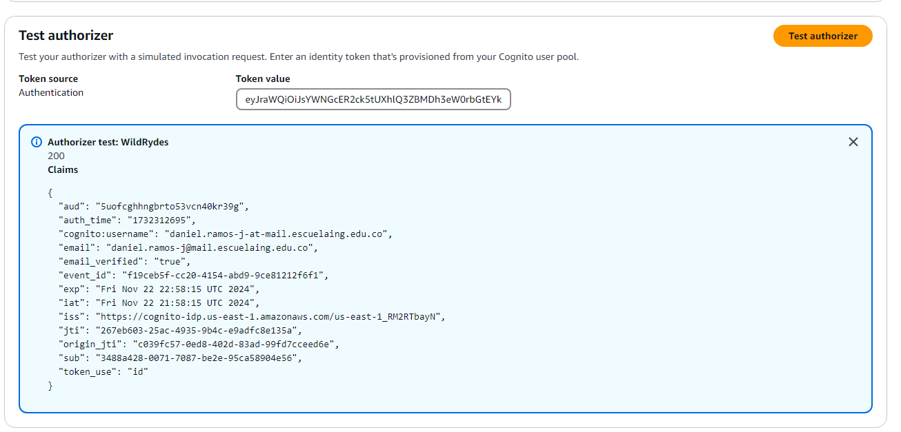
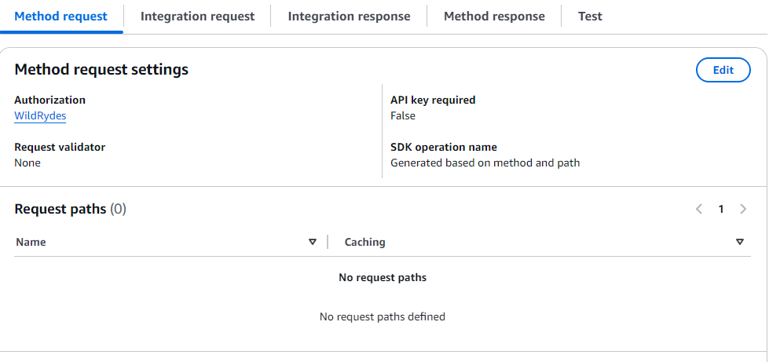

# websecjwt

## Modulo 1


## Modulo 2


configuracion:
```
window._config = {
    cognito: {
        userPoolId: 'us-east-1_RM2RTbayN', // e.g. us-east-2_uXboG5pAb
        userPoolClientId: '5uofcghhngbrto53vcn40kr39g', // e.g. 25ddkmj4v6hfsfvruhpfi7n4hv
        region: 'us-east-1' // e.g. us-east-2
    },
    api: {
        invokeUrl: '' // e.g. https://rc7nyt4tql.execute-api.us-west-2.amazonaws.com/prod',
    }
};
```



## Modulo 3



