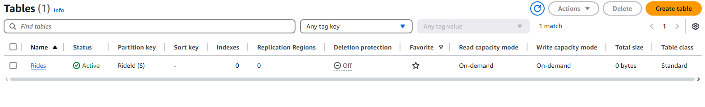
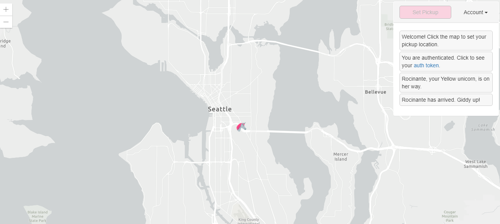

# websecjwt
Proyecto web el cual permite que el usuario cree una cuenta y pueda hacer login para poder pedirle a un unicornio que lo reoja en una ubicación determinada en el mapa

# Arquitectura


La arquitectura del aplicativo está descrita en la anterior imagen, como se puede apreciar primero se tiene un cliente
JS el cual permite renderizar una página web la cual nos permite hacer tanto el registro como el logeo de una cuenta, este
proceso se válida mediante Cognito el cual nos genera un JWT, el proceso de despliegue se hace de manera automatica mediante
Amplify, el cual tambien es el responsable de sostener el frontend.

Cuando el cliente JS hace una petición se realiza mediante el API Gateway el cual válida con Cognito que el token generado 
sea correcto, este API Gateway esá conectado de manera directa con una lambda la cual tiene como objetivo realizar la creación
de entidades una tabla, la cual esta hosteado en DynamoDB.

## Flujo del aplicativo

1. El navegador web carga la aplicación frontend desde AWS Amplify.
2. Los usuarios se autentican utilizando Amazon Cognito, que valida su identidad y emite tokens.
3. Las solicitudes autenticadas del frontend viajan a través del Amazon API Gateway.
4. El API Gateway pasa las solicitudes a AWS Lambda, que ejecuta la lógica necesaria.
5. AWS Lambda interactúa con Amazon DynamoDB para manejar los datos requeridos por la aplicación.

# Paso a paso creacion recursos / evidencias
## Modulo 1

Creación del amplify conectado con el repositorio de github


Página web desplegada


Despliegues realizados al cambiar el titulo de la página web y hacer un commit


## Modulo 2

Creación del Cognito para la autenticación


configuracion realizada de manera local para el cognito:
```
window._config = {
    cognito: {
        userPoolId: 'us-east-1_RM2RTbayN', // e.g. us-east-2_uXboG5pAb
        userPoolClientId: '5uofcghhngbrto53vcn40kr39g', // e.g. 25ddkmj4v6hfsfvruhpfi7n4hv
        region: 'us-east-1' // e.g. us-east-2
    },
    api: {
        invokeUrl: '' // e.g. https://rc7nyt4tql.execute-api.us-west-2.amazonaws.com/prod',
    }
};
```

Prueba de logeo con el usuario creado icnluyendo el código de verificación


Token JWT generado


## Modulo 3

Creación de la tabla Rides en DynamoDB


Creación de la lambda para crear recursos en la DB


Test funcional ejecutado en la lambda


## Modulo 4

Creación del authorizer dentro del api gateway


Configuración del método POST


Prueba de funcionamiento


# Version
1.0

# Author
Daniel Esteban Ramos Jimenez